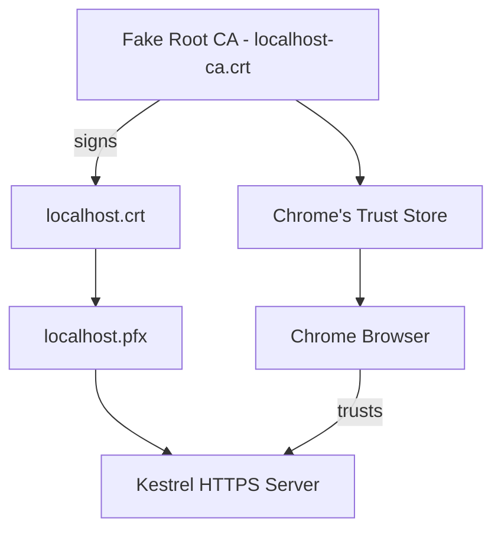

# Dotnet HTTPS Test

## Overview

This GitHub Action tests an ASP.NET Core application running with HTTPS enabled. It demonstrates generating a custom Certificate Authority (CA), creating and signing a localhost certificate, and running an ASP.NET Core web server that Chrome can securely connect to, trusting the self-generated CA.

## How it works

### Step-by-step Process:

1. **Generate a custom root CA:**
   - Create a fake Certificate Authority (CA).
   - Export the CA certificate (`localhost-ca.crt`).

2. **Generate and sign a server certificate:**
   - Generate a localhost certificate (`localhost.crt`) and private key.
   - Sign this certificate using our custom CA.
   - Export these certificates and keys to `.pfx` format (`localhost.pfx`).

3. **Trust the CA certificate in the system:**
   - Add the custom CA certificate to the system's trusted store (in this case, Chrome's trust store).

4. **Run ASP.NET Core with the signed certificate:**
   - Explicitly start ASP.NET Core with HTTPS, using the signed certificate.

5. **Test the HTTPS connection using Chrome:**
   - Chrome connects securely to the ASP.NET Core application, trusting our custom CA.

## Visualization with Mermaid

The following Mermaid diagram visualizes the process:

## Important Generated Files

During the GitHub Action run, these essential files are displayed for easy verification:

- **Localhost CA Certificate** (`localhost-ca.crt`)
- **Localhost Server Certificate** (`localhost.crt`)
- **Application Settings** (`appsettings.json`)

## GitHub Actions Workflow (`yaml`)

The workflow steps are clearly defined in [Fix Https Script](FixHttpsScript.md), which:

- Sets up .NET SDK and Chrome.
- Installs dependencies.
- Runs the HTTPS test script (`gha-https-test.sh`).
- Displays the generated certificate files in the log.

### Further details

The web server presents the signed certificate to Chrome during connection establishment. Chrome verifies this certificate against the trusted CA we've explicitly added, successfully establishing a trusted HTTPS connection despite using custom-generated certificates.
